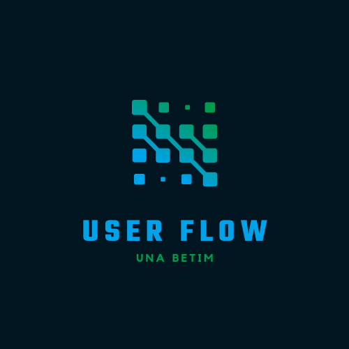

# USER-FLOW

<tr>
   <td align="center"><a></td>
</tr>

# Sobre o Projeto

O projeto consiste em uma parceria da CDL BH com a universidade UNA, onde o objetivo é avaliar a usabilidade e propor melhorias, realizando pesquisas e protótipos
para Portal de associados da CDL BH.

# Tópicos de Interesse:

- 📌Sugerir melhorias (de forma consultiva) na usabilidade;
- 📌Entender a jornada para compreender o que é oferecido pelo site e como o associado consegue atingir uma solução;
- 📌Experiência do cliente no acesso ao site, que já está posto

# Autores

 <table>
  <tr>
    <td align="center"><a href="https://github.com/felipebat20"> <b>Felipe Batista</b></a></td>

   <td align="center"><a href="https://github.com/Serpa27"> <b>Mariane Serpa</b></a></td>

   <td align="center"><a href="https://github.com/PabloCassio"> <b>Pablo Cassio</b></a></td>

   <td align="center"><a href="https://github.com/Taynaratalia"> <b>Taynara Talia</b></a></td>

  </tr>
 </table>

# Licença

Este projeto está licenciado sob a [Licença Apache](https://github.com/PedroSena77/TransporteTech/blob/main/LICENSE), consulte o arquivo LICENSE.md para mais detalhes.

# Agradecimentos
Aos meus colegas de curso, cоm quem convivi intensamente na realização desse projeto, pelo companheirismo e pela troca de experiências e todos aqueles que contribuíram, de alguma forma, para a realização deste trabalho.
